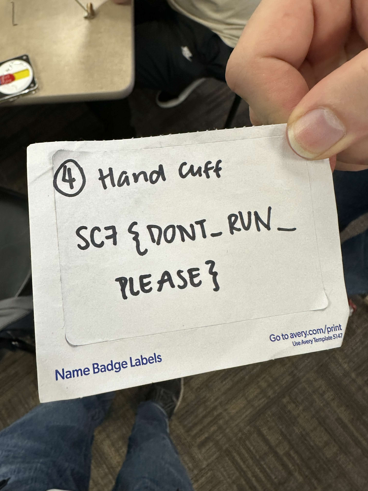
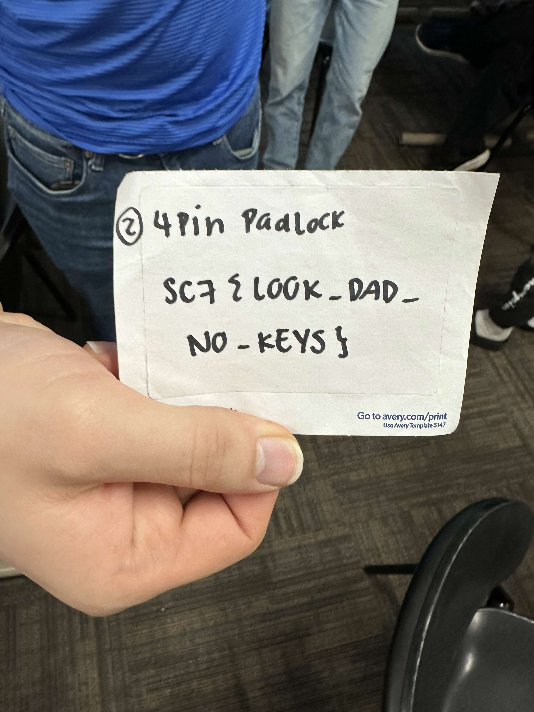
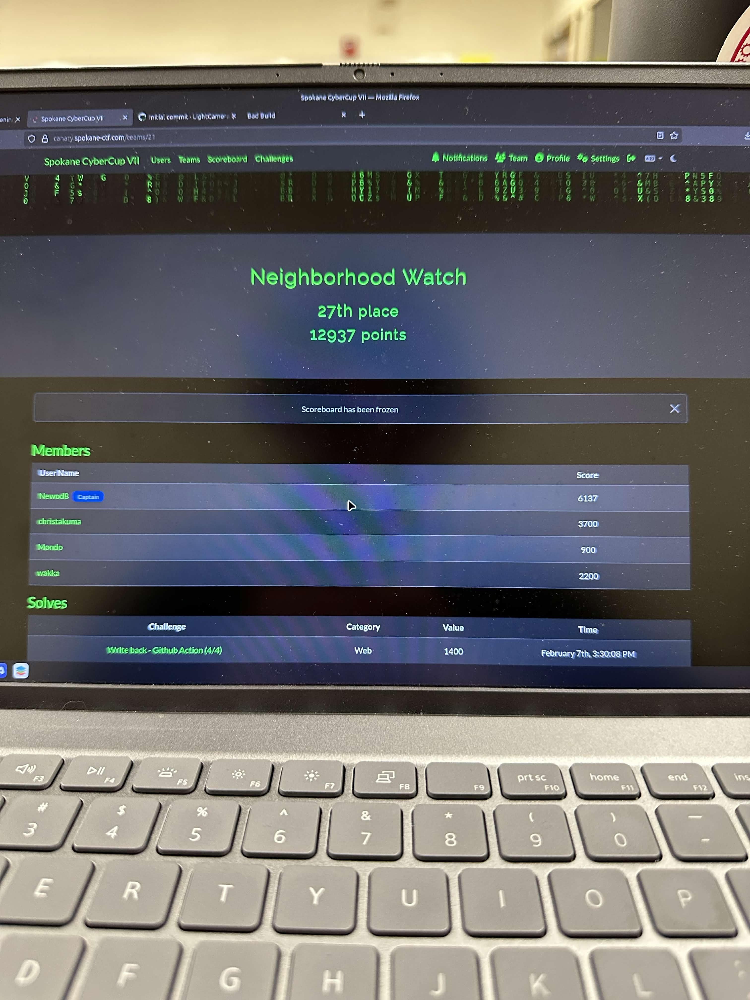

# Spokane-Cyber-Cup-2026
### The Spokane Cyber Cup is an annual cybersecurity CTF competition where teams from all over the PNW come together to solve cybersecurity puzzles and challenges.

## Overview

This year was my second time attending the competition, and I had an amazing time working with my team to solve as many challenges as possible. During the competition, I learned a bunch of new cybersecurity skills. I was able to figure out all of the GitHub challenges!

Fun Fact: This year, they included a lock-picking section, where teams could earn points by having members learn how to pick certain types of locks. I had a blast with this part of the competition, and I was able to successfully pick open a basic 3-pin lock, 4-pin padlock, and even handcuffs, using only a bobby pin.

Despite our team not winning 1st place, I am still so proud of us for learning as much as we did and completing a wide variety of difficult and unique challenges. Here's a picture of our team's placement on the scoreboard!

(Sorry for the huge pictures, I can't specify image size without using HTML)

## Individual Contributions
Here's a list of some of the challenges that I remember solving for my team:
- Picked a basic 3-pin lock with a lockpicking kit
- Picked a 4-pin padlock with a lockpicking kit
- Escaped from being handcuffed behind my back with only a bobby pin
- GitHub Challenges 1-4
  - For the first part of this challenge, I was given access to a private GitHub repo and had to successfully send a pull request to receive the flag.
  - For the second part, I had to exploit GitHub Action workflows to trick the repo into sending me a secret key value stored in the repo's *secret* environmental variables.
  - Next, I had to once again exploit GitHub Action workflows to run the code that I pasted into the description of a created issue by naming the issue [build]. After running the code, I would get the repo to leak another one of the secret keys.
  - Finally, the last challenge of this series required me to use the same issue creation exploit as the last part. When I name the issue [build] and get the repo to run the bash script, I have it create a new file and push it to the repo using Git bash commands. Once completed successfully, the repo was checked for the new file, and the flag was revealed.
- Effectiveness Challenge
  - This challenge was to determine which combination of two types has only one total weakness. By *types* I'm talking about what is essentially custom Pokémon types. Each type has its own weaknesses and strengths, and when combined, they also combine these attributes. After explaining this concept, the challenge provided me with a .csv file that contains all of the custom types and their attributes. [Here's what the chart looks like](./types.csv). To solve the challenge, I made a python script to parse and organize the type data and then calculate how many weaknesses each combination had. [Here's the script](./main.py).
- Phishing
  - This challenge would present me with a series of fake emails and ask me which ones were phishing attempts. After getting a perfect score, I was given the flag.
- Fraud Analytics
  - This challenge gave me another .csv file with fake credit card purchase logs. [Here's the .csv](./purchases.csv). Each entry is marked as either *regular* or *fraudulent*. Given this information, along with the company and location where the purchases were made, I was tasked with finding the exact company and location where the credit cards' information was being stolen. I was able to solve this challenge by loading the file into an Excel editor and using column filters to keep track of possible locations until I narrowed it down to only one.
 
## Conclusions

Overall, I'm very happy with how I performed at this competition. I was able to learn a lot of interesting cybersecurity tricks and methods, and even learned some new physical skills as well (lock-picking). My favorite challenge was the type-effectiveness challenge, which I had to write a Python script to solve; however, all of the GitHub challenges were super fun as well.
